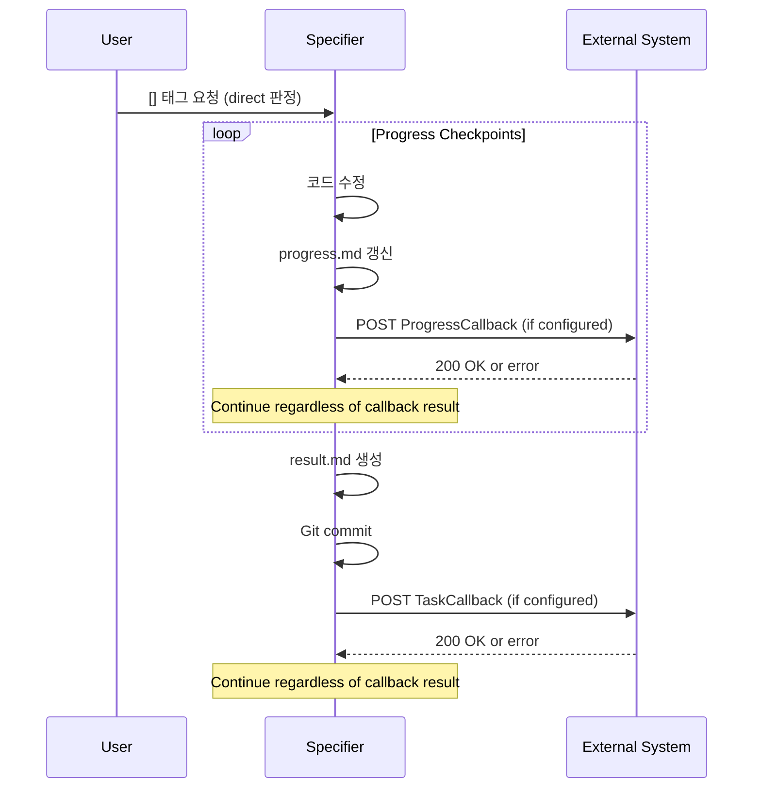
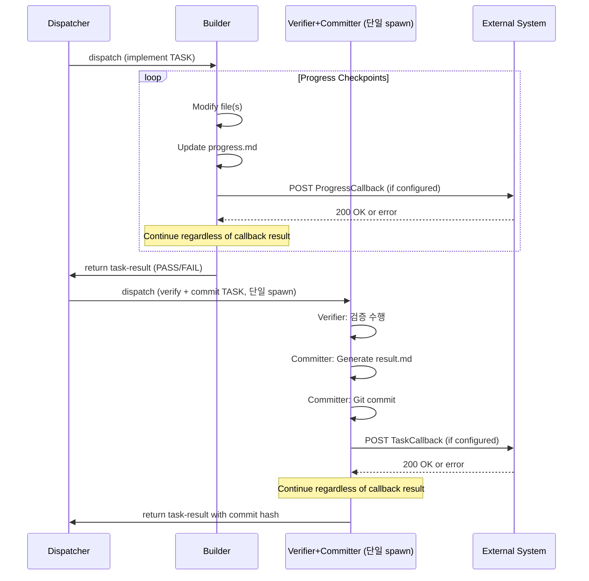

# Specification: Task Callback Integration

## Overview

The uc-taskmanager pipeline supports optional HTTP callbacks for external system integration. This allows external systems (e.g., uc-teamspace) to receive real-time notifications of task progress and completion results.

### Design Principles

1. **Optional Activation**: Callbacks are only active if TaskCallback/ProgressCallback URLs are configured in CLAUDE.md
2. **Failure Tolerance**: If curl fails, agents print a warning and continue (never block task execution)
3. **Universal Compatibility**: Projects without callback configuration operate unchanged
4. **Mode-Invariant**: All three execution-modes (direct, pipeline, full) guarantee COMMITTER DONE callback delivery

### Callback Agents by execution-mode

| execution-mode | TaskCallback 전송 주체 | ProgressCallback 전송 주체 |
|:--------------:|:---------------------:|:-------------------------:|
| `direct` | **Specifier** (committer 역할 대행) | **Specifier** (builder 역할 대행) |
| `pipeline` | **Committer** | **Builder** |
| `full` | **Committer** | **Builder** |

모든 모드에서 COMMITTER DONE 콜백(TaskCallback) 전송은 불변 보장 항목이다.

---

## CLAUDE.md Configuration Spec

Add the following optional fields to your project's `CLAUDE.md`:

```markdown
## Task Callbacks

TaskCallback: http://your-system.com/api/v1/task-result
ProgressCallback: http://your-system.com/api/v1/task-progress
CallbackToken: <bearer-token>
```

### Configuration Fields

| Field | Required | Description | Example |
|-------|----------|-------------|---------|
| `TaskCallback` | Optional | HTTP endpoint to receive final task results (POST) | `http://localhost:3000/api/v1/task-result` |
| `ProgressCallback` | Optional | HTTP endpoint to receive progress updates (POST) | `http://localhost:3000/api/v1/task-progress` |
| `CallbackToken` | Optional | Bearer token for Authorization header | `sk_test_abcd1234...` |

### Behavior

- If `TaskCallback` is missing → No task completion notifications sent
- If `ProgressCallback` is missing → No progress updates sent
- If `CallbackToken` is missing → curl requests use no Authorization header
- If all three are missing → Pipeline operates in standalone mode (no external notifications)

---

## TaskCallback Payload Schema

Sent after git commit completes. Sender varies by execution-mode (see table above).

### JSON Schema

```json
{
  "workId": "WORK-09",
  "taskId": "TASK-01",
  "status": "SUCCESS|PARTIAL|FAILED",
  "what": "Implementation summary: files created/modified/deleted, features added, verification results",
  "why": "Technical reasoning: why implemented this way, alternatives considered",
  "caution": "Edge cases, conditional completion, assumptions made, manual verification needed",
  "incomplete": "Unfinished items, postponed work, known limitations, or empty string if complete",
  "filesChanged": [
    "agents/committer.md",
    "agents/shared-prompt-sections.md"
  ],
  "commitHash": "a3dc4f0",
  "timestamp": "2026-03-12T10:15:30Z"
}
```

### Field Descriptions

| Field | Type | Description |
|-------|------|-------------|
| `workId` | string | WORK identifier (e.g., `WORK-09`) |
| `taskId` | string | Task identifier (e.g., `TASK-01`) — WORK prefix 미포함 |
| `status` | enum | `SUCCESS` = all acceptance criteria met, `PARTIAL` = some criteria incomplete, `FAILED` = task failed |
| `what` | string | Concrete summary of changes: files created/modified, new functions, configuration updates (2-5 lines) |
| `why` | string | Technical reasoning for implementation approach, alternatives considered (2-4 lines) |
| `caution` | string | Edge cases, conditional completion, assumptions, verifier notes (1-3 lines) |
| `incomplete` | string | Unfinished items, postponed work, limitations (1-2 lines, or empty if complete) |
| `filesChanged` | array | List of relative file paths modified (e.g., `["agents/committer.md", "agents/builder.md"]`) |
| `commitHash` | string | Git commit hash (short form, e.g., `a3dc4f0`) |
| `timestamp` | string | ISO 8601 UTC timestamp (e.g., `2026-03-12T10:15:30Z`) |

### HTTP Request Format

```bash
curl -X POST "http://your-system.com/api/v1/runner/task-result" \
  -H "Content-Type: application/json" \
  -H "X-Runner-Api-Key: {RUNNER_API_KEY}" \
  -d '{
    "workId": "WORK-09",
    "taskId": "TASK-01",
    "status": "SUCCESS",
    "what": "Added TaskCallback section to committer.md with conditional curl invocation",
    "why": "Enable external systems to receive task completion notifications",
    "caution": "Curl failure must not block commit completion",
    "incomplete": "",
    "filesChanged": ["agents/committer.md"],
    "commitHash": "a3dc4f0"
  }'
```

### Expected Response

- **Success (2xx)**: Callback received and processed
- **Failure (4xx/5xx)**: Callback processing failed
- **Network Error**: Connection timeout, DNS failure, etc.

**Agent Behavior on Failure**: Print warning and continue (commit already completed)

---

## ProgressCallback Payload Schema

Sent after progress.md checkpoint updates. Sender varies by execution-mode (see table above).

### JSON Schema

```json
{
  "workId": "WORK-09",
  "taskId": "WORK-09-TASK-02",
  "status": "IN_PROGRESS|COMPLETED|FAILED",
  "checklist": [
    {
      "item": "agents/builder.md modified",
      "done": true
    },
    {
      "item": "agents/shared-prompt-sections.md checked",
      "done": true
    },
    {
      "item": "Documentation updated",
      "done": false
    }
  ],
  "currentReasoning": "Currently updating builder.md with ProgressCallback section. Remaining: shared-prompt-sections.md reference, verifier.md integration.",
  "timestamp": "2026-03-12T10:16:45Z"
}
```

### Field Descriptions

| Field | Type | Description |
|-------|------|-------------|
| `workId` | string | WORK identifier |
| `taskId` | string | Task identifier |
| `status` | enum | `IN_PROGRESS` = task ongoing, `COMPLETED` = all work done, `FAILED` = task failed |
| `checklist` | array | List of completed/pending work items (each with `item` name and `done` boolean) |
| `currentReasoning` | string | Human-readable summary of progress so far and what remains |
| `timestamp` | string | ISO 8601 UTC timestamp |

### HTTP Request Format

```bash
curl -X POST "http://your-system.com/api/v1/task-progress" \
  -H "Content-Type: application/json" \
  -H "Authorization: Bearer sk_test_abcd1234..." \
  -d '{
    "workId": "WORK-09",
    "taskId": "WORK-09-TASK-02",
    "status": "IN_PROGRESS",
    "checklist": [
      {"item": "agents/builder.md modified", "done": true},
      {"item": "Verification passed", "done": true},
      {"item": "Documentation review", "done": false}
    ],
    "currentReasoning": "Completed builder.md changes. Verifying against acceptance criteria.",
    "timestamp": "2026-03-12T10:16:45Z"
  }'
```

### Callback Frequency

- Called **multiple times per TASK** (once per progress checkpoint)
- Example: file 1 created → callback, file 2 modified → callback, final status → callback
- External system should be prepared for duplicate timestamps and incremental updates

### Expected Response

- **Success (2xx)**: Callback received and processed
- **Failure (4xx/5xx)**: Callback processing failed
- **Network Error**: Connection timeout, DNS failure, etc.

**Agent Behavior on Failure**: Print warning and continue (implementation continues)

---

## Callback Execution Flow by execution-mode

### direct 모드 — Specifier 겸임 수행



### pipeline / full 모드 — 서브에이전트 수행

v1.6.0부터 Verifier와 Committer는 **단일 spawn**으로 결합 실행된다.
Committer는 verifier+committer spawn 내에서 verifier 검증 완료 후 TaskCallback을 전송한다.



*pipeline 모드의 Dispatcher는 Main Claude(Specifier+Planner spawn 완료 후), full 모드의 Dispatcher는 Scheduler.*

### Timeline (pipeline / full 공통)

1. **Builder Phase** (독립 spawn):
   - Modifies files and updates progress.md
   - After each checkpoint: if ProgressCallback configured → curl POST
   - If curl fails: print WARNING and continue
   - Returns task-result (PASS/FAIL)

2. **Verifier+Committer Phase** (단일 spawn — v1.6.0):
   - **Verifier 역할**: Reviews builder's work and progress.md
   - No callbacks triggered during verification
   - **Committer 역할** (동일 spawn 내, verifier 완료 후):
     - Creates result.md report
     - Performs git commit
     - After commit succeeds: if TaskCallback configured → curl POST with result summary
     - If curl fails: print WARNING and continue
     - Returns task-result with commit hash

---

## Error Handling Strategy

### Curl Failures

**Scenario**: `curl: (7) Failed to connect to host` or `curl: (28) Operation timeout`

**Agent Behavior**:
```bash
curl ... 2>/dev/null || echo "WARNING: callback request failed ($CALLBACK_URL), continuing..."
```

**Result**:
- Warning message logged
- Task execution continues
- No retry attempted
- Commit/result already finalized (for committer/specifier)

### Network Transience

**Assumption**: Network issues are temporary and non-critical.

**Rationale**:
- Pipeline reliability should not depend on external system availability
- Callbacks are best-effort notifications, not critical path
- External system should implement client-side polling if needed

### Timeouts

**Default**: Use curl default timeout (usually 30 seconds)

**Recommendation for Receivers**:
- Implement idempotency: handle duplicate timestamp/same `commitHash` as single operation
- Log all received callbacks (audit trail)
- Don't block sender on slow processing

### Authorization Failures

**Scenario**: External system returns `401 Unauthorized` or `403 Forbidden`

**Agent Behavior**:
- Print warning message
- Continue (no retry)
- Check `CallbackToken` value in CLAUDE.md

**Debugging Steps**:
1. Verify `CallbackToken` is correct
2. Check external system endpoint authentication requirements
3. Test curl manually with correct headers

---

## Implementation Guide for External Systems

### Receiving TaskCallback (Committer/Specifier Results)

Expected HTTP request:

```
POST /api/v1/task-result
Content-Type: application/json
Authorization: Bearer <token>

{
  "workId": "WORK-09",
  "taskId": "WORK-09-TASK-01",
  "status": "SUCCESS",
  "what": "...",
  "why": "...",
  "caution": "...",
  "incomplete": "...",
  "filesChanged": ["agents/committer.md"],
  "commitHash": "a3dc4f0",
  "timestamp": "2026-03-12T10:15:30Z"
}
```

### Receiving ProgressCallback (Builder/Specifier Checkpoints)

Expected HTTP requests (multiple):

```
POST /api/v1/task-progress
Content-Type: application/json
Authorization: Bearer <token>

{
  "workId": "WORK-09",
  "taskId": "WORK-09-TASK-02",
  "status": "IN_PROGRESS",
  "checklist": [
    {"item": "agents/builder.md modified", "done": true},
    {"item": "agents/shared-prompt-sections.md checked", "done": false}
  ],
  "currentReasoning": "...",
  "timestamp": "2026-03-12T10:16:45Z"
}
```

### Idempotency Considerations

Since **multiple ProgressCallbacks** can be sent per TASK:

1. Use `(taskId, timestamp)` as idempotency key for progress updates
2. If `timestamp` is identical → duplicate from same checkpoint
3. If `timestamp` differs → new checkpoint

For **TaskCallback**:
1. Use `commitHash` as idempotency key
2. Single TaskCallback per task completion
3. Same `commitHash` → duplicate (ignore)

### Implementation Checklist

- [ ] Endpoint accepts POST with `Content-Type: application/json`
- [ ] Validates `Authorization: Bearer <token>` header
- [ ] Parses JSON payload according to schema
- [ ] Stores task result in database or cache
- [ ] Returns `200 OK` (or `204 No Content`)
- [ ] Implements error logging for failed requests
- [ ] Implements idempotency for duplicate callbacks
- [ ] (Optional) Triggers notifications based on status (`SUCCESS`, `FAILED`, etc.)
- [ ] (Optional) Updates real-time dashboard with progress

---

## Example: uc-teamspace Integration

### CLAUDE.md Configuration

```markdown
## Task Callbacks

TaskCallback: http://localhost:3000/api/v1/execution/{{executionId}}/task-result
ProgressCallback: http://localhost:3000/api/v1/execution/{{executionId}}/task-progress
CallbackToken: sk_live_execution_token_xyz
```

### uc-teamspace Handler (Node.js Example)

```javascript
// POST /api/v1/execution/:executionId/task-result
app.post("/api/v1/execution/:executionId/task-result", (req, res) => {
  const { workId, taskId, status, commitHash, timestamp } = req.body;

  // Log callback
  console.log(`[${timestamp}] ${taskId} completed with status=${status}`);

  // Update execution status
  db.updateTaskResult({
    executionId: req.params.executionId,
    taskId,
    status,
    commitHash,
    receivedAt: new Date(),
  });

  // Trigger notification if SUCCESS
  if (status === "SUCCESS") {
    notifications.send({
      type: "task_completed",
      taskId,
      message: `Task ${taskId} completed successfully`,
    });
  }

  res.status(200).json({ received: true });
});

// POST /api/v1/execution/:executionId/task-progress
app.post("/api/v1/execution/:executionId/task-progress", (req, res) => {
  const { workId, taskId, status, checklist, timestamp } = req.body;

  // Update real-time dashboard
  realtime.emit("task_progress", {
    executionId: req.params.executionId,
    taskId,
    status,
    progress: `${checklist.filter(c => c.done).length}/${checklist.length}`,
    timestamp,
  });

  res.status(200).json({ received: true });
});
```

---

## Testing Callback Integration

### 1. Local Testing with Mock Endpoint

```bash
# Start local callback receiver
nc -l 127.0.0.1 3000 &

# Or use a tool like httpbin
curl https://httpbin.org/post -X POST -d '{"test": "data"}'
```

### 2. Add to CLAUDE.md

```markdown
## Task Callbacks

TaskCallback: http://127.0.0.1:3000/task-result
ProgressCallback: http://127.0.0.1:3000/task-progress
CallbackToken: test_token_123
```

### 3. Run Pipeline and Monitor

```bash
# Monitor curl calls
strace -e trace=network -f builder.sh 2>&1 | grep curl
```

### 4. Verify Callback Format

```bash
# Manually test with curl
curl -X POST "http://127.0.0.1:3000/task-result" \
  -H "Content-Type: application/json" \
  -H "Authorization: Bearer test_token_123" \
  -d '{"workId":"WORK-09","taskId":"WORK-09-TASK-01","status":"SUCCESS","commitHash":"abc123"}'
```

---

## Version & History

- **Created**: 2026-03-12
- **Purpose**: WORK-09 — Document callback integration design for external system notifications
- **Updated**: 2026-03-14 — WORK-10 (SDD v1.3): execution-mode 3종 체계 반영
  - execution-mode별 콜백 전송 주체 명시 (direct: Specifier, pipeline/full: Builder/Committer)
  - 불변 보장: 모든 모드에서 COMMITTER DONE 콜백(TaskCallback) 전송 보장
  - Sequence diagram을 direct 모드 / pipeline+full 모드로 분리
- **Updated**: 2026-03-15 — WORK-19: Related Documents 갱신 (file-content-schema.md 추가, 섹션 참조 현행화)
- **Updated**: 2026-03-28 — WORK-45: verifier+committer 단일 spawn 결합 반영. pipeline/full 모드 Sequence diagram 갱신 (Verifier+Committer 단일 참여자로 통합). Timeline 섹션에 단일 spawn 구분 명시.
- **Referenced by**: CLAUDE.md, agents/builder.md (ProgressCallback), agents/committer.md, agents/specifier.md (direct 모드 콜백)

---

## Related Documents

- `agents/shared-prompt-sections.md` § 6: Task Callbacks configuration guide (현재 § 미존재 → CLAUDE.md 직접 참조)
- `agents/specifier.md` → direct 모드: Specifier가 직접 콜백 전송
- `agents/builder.md` → ProgressCallback: Builder implementation (pipeline/full)
- `agents/committer.md` → Committer implementation (pipeline/full)
- `agents/xml-schema.md`: Agent communication format + execution-mode attribute
- `agents/file-content-schema.md`: 파이프라인 산출물 포맷 단일 정의
- `docs/spec_pipeline-architecture.md`: 전체 파이프라인 구조 및 불변 보장 항목
